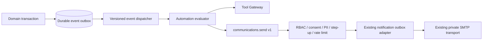

# ASODEF Connect — events, automation and communications foundation

Status: contract foundation, not deployed. Baseline audited at `origin/main` commit
`662cb7bfba6f1429d01f86a5e232db1a193a3c67` on 2026-08-22.

## Brownfield audit

| Area                  | Verified implementation                                                                                                                                             | Constraint for this foundation                                                                                                              |
| --------------------- | ------------------------------------------------------------------------------------------------------------------------------------------------------------------- | ------------------------------------------------------------------------------------------------------------------------------------------- |
| Notification outbox   | `NotificationJob` is a PostgreSQL durable outbox. A lease worker claims with `FOR UPDATE SKIP LOCKED`.                                                              | Reuse it through an adapter; do not build a second EMAIL worker.                                                                            |
| Delivery semantics    | At-least-once with a stable hashed SMTP `Message-ID`; uncertain acceptance becomes terminal `UNKNOWN_RESULT`.                                                       | A generic platform must preserve the distinction between retryable failure and unknown result.                                              |
| Retry/dead letter     | Exponential backoff is capped at 15 minutes; permanent failures or exhausted attempts become `DEAD_LETTER`.                                                         | Generic policy may be configurable only through reviewed, published versions.                                                               |
| Mail transport        | `SmtpMailTransport` uses Nodemailer, the configured private connect host, required TLS for submission, certificate hostname validation and optional authentication. | No direct SMTP use by Koral or automations. The adapter remains behind `communications.send`.                                               |
| Legacy communications | `NotificationService.send()` checks marketing suppression/consent but deliberately records `transport_not_implemented`; it does not use SMTP.                       | Do not represent this legacy method as successful delivery. Replace it later with a compatibility adapter after persistence contracts land. |
| Templates             | Source-controlled append-only versions, content hashes, exact declared variables and a strict plain-text renderer already exist for security email.                 | Preserve queued snapshots and hashes; generalize lifecycle without mutating published versions.                                             |
| Consent/preferences   | Marketing checks `SuppressionListEntry` and current `optional_marketing` consent; unsubscribe is idempotent.                                                        | Resolve consent and preferences before enqueue. Keep transactional and marketing decisions separate.                                        |
| Audit                 | Domain transitions use transaction-coupled `AuditService`; notification terminal failures also emit security evidence.                                              | Every decision and execution needs correlation and minimized audit metadata; never store rendered content in logs.                          |
| Redis/queues          | Redis provides health/rate-limit infrastructure. The audited mail queue is PostgreSQL, not Redis/BullMQ.                                                            | Redis may coordinate rate limits/short leases, but cannot be the sole durable event, execution or delivery record.                          |
| CRM/PQR/payments      | These domains have persistence and transaction workflows; payment events already enforce a unique idempotency key. No shared domain-event publisher exists.         | Producers need an atomic outbox adapter and their own versioned payload schema before emitting. Do not call domains directly.               |

No Postfix, OpenDKIM, SMTP, TLS, anti-relay, anti-spoof, Firebird, Legal or
production configuration is modified by this change.

## Boundary and flow

- Koral can request tools and `communications.send`; it cannot call SMTP,
  PostgreSQL, Prisma, Redis or Firebird.
- Domain producers append their domain mutation and event-outbox row in the
  same transaction. Consumers use `eventId` plus their own consumer identity
  as an inbox deduplication key.
- No event consumer imports another domain service. Cross-domain effects are
  declarative automation actions through Tool Gateway or new events.
- Event payload contracts are intentionally not invented here. Each producer
  owns and registers the payload schema for `(eventType, schemaVersion)` before
  it emits; the common envelope still validates independently.

## Cross-contract reconciliation: PR #19, #10 and #20

This contract was reviewed against PR #19 (`codex/connect-koral-core`), PR #10
(`phase2/business-core-maturity`) and PR #20
(`codex/connect-business-ai-gateway`, stacked on PR #10).

`ConversationEvent` from PR #19 and `DomainEvent` are intentionally different:

| Concern       | ConversationEvent                                             | DomainEvent                                                      |
| ------------- | ------------------------------------------------------------- | ---------------------------------------------------------------- |
| Purpose       | Internal append-only conversation timeline and audit evidence | Published business/integration fact for independent consumers    |
| Scope         | One conversation, FK-backed                                   | Domain-neutral envelope plus producer-owned payload schema       |
| Storage       | `conversation_events`                                         | Future durable event outbox/inbox                                |
| Publication   | Never automatic                                               | Explicit transaction-coupled publish                             |
| Typical facts | Message received, assignment, internal note, return to Koral  | `ConversationEscalated`, payment, contract or PQR business facts |

There is no second generic envelope for conversations. A reviewed promotion
creates a new DomainEvent identity, inherits `correlationId`, sets
`causationId=ConversationEvent.id`, preserves the source `occurredAt`, uses
`producer=koral-conversations`, maps subject to
`(subjectType=conversation, subjectId=conversationId)`, and derives a new
layer-scoped idempotency key. Message bodies and raw conversation metadata are
never copied. Missing correlation fails publication closed.
PR #19 does not yet persist a `CONVERSATION_ESCALATED` timeline event; that is an
explicit producer dependency. Assignment or message-received events are not
silently reclassified as escalation.

PR #10's CRM mutations remain application-service operations. They may append a
DomainEvent atomically, but CRM never calls mail directly. PR #20's Tool Gateway
wraps `communications.send` as `send_communication@v1`; the binding stays
`REVIEW/CONTRACT_ONLY` until a real `CommunicationsService.send` adapter exists.
Tool Gateway supplies actor, permissions, identity level and `correlationId`
through trusted invocation context. Koral controls only the validated business
request and cannot assert those fields or receive SMTP/provider configuration.

Trace semantics across contracts:

- `correlationId`: stable workflow trace inherited from conversation/gateway
  context;
- `causationId`: immediate predecessor event or authorized command reference;
- `idempotencyKey`: operation-scoped and derived per layer, never blindly reused;
- `schemaVersion`: positive integer for DomainEvent payload compatibility;
  contract APIs retain their published `v1`/`1.0.0` identifiers;
- `occurredAt`: time the source fact occurred, not dispatcher time;
- `producer`: stable publishing service identity;
- subject: the pair `subjectType + subjectId`, not a database object.

Existing `AuditService`, `ConversationEvent`, Tool Gateway audit references,
automation execution history and communication delivery audit each retain their
own authority. DomainEvent links them through trace IDs; it does not replace or
duplicate their evidence.

## Public contract catalog

The executable TypeScript catalog is in `@asodef/connect-contracts`.

| Contract                           | Version | Permission                                                                                 | Idempotency                                                        |
| ---------------------------------- | ------- | ------------------------------------------------------------------------------------------ | ------------------------------------------------------------------ |
| `events.publish`                   | `1.0.0` | `events.publish:<eventType>`                                                               | `producer + idempotencyKey`; duplicate returns the original event. |
| `automations.execute`              | `1.0.0` | `automations.execute` and automation scope                                                 | Version/mode/key; duplicate returns the original execution.        |
| `communications.send`              | `1.0.0` | `communications.send`; test mode additionally needs `communications.test-send` and step-up | Requester/key; duplicate never enqueues again.                     |
| `communications.templates.preview` | `1.0.0` | `communications.templates.preview`                                                         | Read-only; no state mutation.                                      |

Every descriptor contains input/output schemas, classified errors, permissions,
audit semantics and idempotency semantics. API transports must expose only
stable error codes, never provider errors, credentials, rendered bodies or raw
recipient data.

## Domain events

Envelope v1 contains exactly:

`eventId`, `eventType`, `schemaVersion`, `occurredAt`, `producer`,
`subjectType`, `subjectId`, `correlationId`, `causationId`, `idempotencyKey`,
and `payload`.

The initial registered vocabulary is `LeadCreated`, `OpportunityWon`,
`CompanyCreated`, `PlanPublished`, `ContractCreated`, `ContractApproved`,
`ContractExpiring`, `PaymentReceived`, `PaymentFailed`, `PqrCreated`,
`PqrResolved`, `ConsentGranted`, `ConversationEscalated`,
`CommunicationRequested`, `CommunicationDelivered` and `CommunicationFailed`.

Adding fields incompatibly requires a new `schemaVersion`. Producers must
support the previous published version during an agreed migration window.

## Automation model

The contract defines `Automation`, immutable `AutomationVersion`, `Trigger`,
declarative `Condition`, declarative `Action`, `Execution`, `ExecutionStep`,
`Retry` and `DeadLetter`. Execution modes are `EVENT`, `SCHEDULE` and
`MANUAL_AUTHORIZED`.

Lifecycle is `DRAFT -> REVIEW -> PUBLISHED -> ACTIVE`; active versions may be
`DISABLED` and later reactivated, or `RETIRED`. Direct draft activation is
invalid. Manual execution requires RBAC and, when declared by the trigger,
step-up. An action can only call a versioned Tool Gateway capability, call
`communications.send`, or emit a registered event. Conditions contain no SQL,
code, Prisma expressions or arbitrary scripts.

Every execution persists timeout policy, attempt count, exponential backoff,
step history, sanitized failure reason, correlation/causation IDs and audit
decisions. A dead letter is evidence: it is never silently deleted. Requeue
requires explicit permission, a new idempotency key tied to the dead-letter ID,
step-up for sensitive actions and an audit record.

## Communications and templates

The model defines `Communication`, `CommunicationRecipient`,
`CommunicationTemplate`, immutable `TemplateVersion`, `DeliveryAttempt` and
`CommunicationPreference`. `EMAIL` is the only real transport in this phase;
`WHATSAPP`, `WEB_NOTIFICATION` and `FUTURE` fail closed as contract-only.

`communications.send` validates RBAC, recipient shape, purpose, consent and
suppression, PII policy, rate limit, template publication and exact variables
before durable enqueue. A successful enqueue is not delivery. Delivery emits
`CommunicationDelivered`; terminal or uncertain outcomes emit
`CommunicationFailed` with sanitized reason codes.

Managed templates follow `DRAFT -> REVIEW -> PUBLISHED -> RETIRED/ROLLED_BACK`.
Published content is immutable and content-addressed. The renderer accepts only
declared `{{variable}}` interpolation: no property traversal, helpers, control
flow, HTML execution, scripts or arbitrary code. Preview is permissioned.
Test-send uses `communications.send` with `testMode=true`, requires the separate
permission plus recent step-up, is rate-limited and remains fully audited.
Actor, authorization and trace context are supplied separately by the
authenticated Tool Gateway boundary; they are never accepted as request fields
produced by an LLM. The request carries the PR #20 data-classification vocabulary
and a declared consent requirement, while the gateway independently verifies
both against policy and authoritative records. `communications.send` returns a
queue/suppression result and audit reference—not a false delivery claim.

## Integration gates before runtime activation

1. Add durable event/inbox and automation persistence with non-destructive
   migrations and unique idempotency constraints.
2. Register producer-owned payload schemas; dependencies are unresolved until
   those domain owners publish them.
3. Implement `communications.send` as an adapter over the existing encrypted
   notification outbox and SMTP transport. Preserve stable message identity,
   retry classification, `UNKNOWN_RESULT` and dead-letter behavior.
4. Run existing notification outbox, SMTP transport, consent, PQR, CRM and
   payment integration suites plus the new contract gates.
5. Activate no automation until its version is reviewed, published and
   explicitly made `ACTIVE` in the Control Plane.

This foundation introduces no API endpoint, database migration, deployment or
production mutation.
