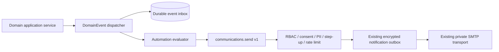

# ASODEF Connect — events, automation and communications foundation

Status: initial runtime, not deployed. Built from `origin/main` commit
`b3fd305caec24577e95ef02152523d4fc61aa943` on 2026-08-22 after the canonical
contracts and Control Plane foundation were integrated.

## Brownfield audit

| Area                  | Verified implementation                                                                                                                                             | Constraint for this foundation                                                                                                              |
| --------------------- | ------------------------------------------------------------------------------------------------------------------------------------------------------------------- | ------------------------------------------------------------------------------------------------------------------------------------------- |
| Notification outbox   | `NotificationJob` is a PostgreSQL durable outbox. A lease worker claims with `FOR UPDATE SKIP LOCKED`.                                                              | Reuse it through an adapter; do not build a second EMAIL worker.                                                                            |
| Delivery semantics    | At-least-once with a stable hashed SMTP `Message-ID`; uncertain acceptance becomes terminal `UNKNOWN_RESULT`.                                                       | A generic platform must preserve the distinction between retryable failure and unknown result.                                              |
| Retry/dead letter     | Exponential backoff is capped at 15 minutes; permanent failures or exhausted attempts become `DEAD_LETTER`.                                                         | Generic policy may be configurable only through reviewed, published versions.                                                               |
| Mail transport        | `SmtpMailTransport` uses Nodemailer, the configured private connect host, required TLS for submission, certificate hostname validation and optional authentication. | No direct SMTP use by Koral or automations. The adapter remains behind `communications.send`.                                               |
| Legacy communications | `NotificationService.send()` checks marketing suppression/consent but deliberately records `transport_not_implemented`; it does not use SMTP.                       | Do not represent this legacy method as successful delivery. Replace it later with a compatibility adapter after persistence contracts land. |
| Templates             | Source-controlled append-only versions, content hashes, exact declared variables and a strict plain-text renderer already exist for security email.                 | Preserve queued snapshots and hashes; generalize lifecycle without mutating published versions.                                             |
| Consent/preferences   | Marketing checks `SuppressionListEntry` and current `optional_marketing` consent; unsubscribe is idempotent.                                                        | Resolve consent and preferences before enqueue. Keep transactional and marketing decisions separate.                                        |
| Audit                 | Domain transitions use transaction-coupled `AuditService`; notification terminal failures also emit security evidence.                                              | Every decision and execution needs correlation and minimized audit metadata; never store rendered content in logs.                          |
| Redis/queues          | Redis provides health/rate-limit infrastructure. The audited mail queue is PostgreSQL, not Redis/BullMQ.                                                            | Redis may coordinate rate limits/short leases, but cannot be the sole durable event, execution or delivery record.                          |
| CRM/PQR/payments      | These domains have persistence and transaction workflows; payment events already enforce a unique idempotency key. No shared domain-event publisher exists.         | Producers need an atomic outbox adapter and their own versioned payload schema before emitting. Do not call domains directly.               |

No Postfix, OpenDKIM, SMTP, TLS, anti-relay, anti-spoof, Firebird, Legal or
production configuration is modified by this change.

## Boundary and flow

- Koral cannot invoke `communications.send` while its governed tool remains in
  `REVIEW`; its runtime mode is `RUNTIME_AVAILABLE`, but after publication it
  may request it only through Tool
  Gateway. It never calls SMTP, PostgreSQL, Prisma, Redis or Firebird.
- No CRM, PQR or Contracts producer is wired in this runtime. A future producer
  must append its domain mutation and outbox row in the same transaction, then
  submit the canonical envelope to this dispatcher. Direct transport calls are
  forbidden.
- No event consumer imports another domain service. Cross-domain effects are
  declarative automation actions through Tool Gateway or new events.
- Event payload contracts are intentionally not invented here. Each producer
  owns and registers the payload schema for `(eventType, schemaVersion)` before
  it emits; the common envelope still validates independently.

## Cross-contract reconciliation after Business Core, gateways and Koral

This contract uses the foundations now integrated in `main` as authoritative:
Business Core, AI/Tool/Knowledge Gateway and Koral Conversation Core.

Koral `ConversationEvent` and `DomainEvent` are intentionally different:

| Concern       | ConversationEvent                                             | DomainEvent                                                      |
| ------------- | ------------------------------------------------------------- | ---------------------------------------------------------------- |
| Purpose       | Internal append-only conversation timeline and audit evidence | Published business/integration fact for independent consumers    |
| Scope         | One conversation, FK-backed                                   | Domain-neutral envelope plus producer-owned payload schema       |
| Storage       | `conversation_events`                                         | Durable `connect_domain_events` integration inbox                 |
| Publication   | Never automatic                                               | Explicit transaction-coupled publish                             |
| Typical facts | Message received, assignment, internal note, return to Koral  | `ConversationEscalated`, payment, contract or PQR business facts |

There is no second generic envelope for conversations. A reviewed promotion
creates a new DomainEvent identity, inherits `correlationId`, sets
`causationId=ConversationEvent.id`, preserves the source `occurredAt`, uses
`producer=koral-conversations`, maps subject to
`(subjectType=conversation, subjectId=conversationId)`, and derives a new
layer-scoped idempotency key. Message bodies and raw conversation metadata are
never copied. Missing correlation fails publication closed.
Koral does not yet persist a `CONVERSATION_ESCALATED` timeline event; that is an
explicit future producer dependency. Assignment, handoff or message-received
events are not silently reclassified as escalation.

Business Core mutations remain application-service operations. No producer is
wired by this change; a future producer may append a DomainEvent atomically with
its domain mutation, but CRM never calls mail directly.
The canonical Tool Gateway describes `communications.send` as
`send_communication@v1`; the binding is now `REVIEW/RUNTIME_AVAILABLE` because
`CommunicationsService.send` durably enqueues through the existing EMAIL
outbox. REVIEW deliberately prevents Koral execution until a separate
Control Plane publication decision. Tool Gateway supplies actor,
permissions, identity level, correlation and policy through the canonical
`GatewayRequestContext`. Koral controls only the validated business request and
cannot assert trusted context or receive SMTP/provider configuration.

Trace semantics across contracts:

- `correlationId`: stable workflow trace inherited from conversation/gateway
  context;
- `causationId`: immediate predecessor event or authorized command reference;
- `idempotencyKey`: operation-scoped and derived per layer, never blindly reused;
- `schemaVersion`: positive integer for DomainEvent payload compatibility;
  contract APIs retain their published `v1`/`1.0.0` identifiers;
- `occurredAt`: time the source fact occurred, not dispatcher time;
- `producer`: stable publishing service identity;
- subject: the pair `subjectType + subjectId`, not a database object.

Existing `AuditService`, `ConversationEvent`, Tool Gateway audit references,
automation execution history and communication delivery audit each retain their
own authority. DomainEvent links them through trace IDs; it does not replace or
duplicate their evidence.

## Public contract catalog

The executable TypeScript catalog is in `@asodef/connect-contracts`.

| Contract                           | Version | Permission                                                                                 | Idempotency                                                        |
| ---------------------------------- | ------- | ------------------------------------------------------------------------------------------ | ------------------------------------------------------------------ |
| `events.publish`                   | `1.0.0` | `events.publish:<eventType>`                                                               | `producer + idempotencyKey`; duplicate returns the original event. |
| `automations.execute`              | `1.0.0` | `automations.execute` and automation scope                                                 | Version/mode/key; duplicate returns the original execution.        |
| `communications.send`              | `1.0.0` | `communications.send`; test mode additionally needs `communications.test-send` and step-up | Requester/key; duplicate never enqueues again.                     |
| `communications.templates.preview` | `1.0.0` | `communications.templates.preview`                                                         | Read-only; no state mutation.                                      |

Every descriptor contains input/output schemas, classified errors, permissions,
audit semantics and idempotency semantics. API transports must expose only
stable error codes, never provider errors, credentials, rendered bodies or raw
recipient data.

## Domain events

Envelope v1 contains exactly:

`eventId`, `eventType`, `schemaVersion`, `occurredAt`, `producer`,
`subjectType`, `subjectId`, `correlationId`, `causationId`, `idempotencyKey`,
and `payload`.

The initial registered vocabulary is `LeadCreated`, `OpportunityWon`,
`CompanyCreated`, `PlanPublished`, `ContractCreated`, `ContractApproved`,
`ContractExpiring`, `PaymentReceived`, `PaymentFailed`, `PqrCreated`,
`PqrResolved`, `ConsentGranted`, `ConversationEscalated`,
`CommunicationRequested`, `CommunicationDelivered` and `CommunicationFailed`.

Adding fields incompatibly requires a new `schemaVersion`. Producers must
support the previous published version during an agreed migration window.

## Automation model

The contract defines `Automation`, immutable `AutomationVersion`, `Trigger`,
declarative `Condition`, declarative `Action`, `Execution`, `ExecutionStep`,
`Retry` and `DeadLetter`. Execution modes are `EVENT`, `SCHEDULE` and
`MANUAL_AUTHORIZED`.

Lifecycle is `DRAFT -> REVIEW -> PUBLISHED -> ACTIVE`; active versions may be
`DISABLED` and later reactivated, or `RETIRED`. Direct draft activation is
invalid. Manual execution requires RBAC and, when declared by the trigger,
step-up. An action can only call a versioned Tool Gateway capability, call
`communications.send`, or emit a registered event. Conditions contain no SQL,
code, Prisma expressions or arbitrary scripts.

Every execution persists timeout policy, attempt count, exponential backoff,
step history, sanitized failure reason, correlation/causation IDs and audit
decisions. A dead letter is evidence: it is never silently deleted. Requeue
requires explicit permission, a new idempotency key tied to the dead-letter ID,
step-up for sensitive actions and an audit record.

The initial executor activates only `EVENT` triggers with declarative
conditions and `COMMUNICATION_SEND` actions. `SCHEDULE`, `MANUAL_AUTHORIZED`,
generic `TOOL_CALL` and `EMIT_EVENT` retain their contracts but have no runtime
binding yet. Retryable steps are picked up by a bounded worker; tests disable
all automatic workers and use the in-memory mail adapter.

## Communications and templates

The model defines `Communication`, `CommunicationRecipient`,
`CommunicationTemplate`, immutable `TemplateVersion`, `DeliveryAttempt` and
`CommunicationPreference`. EMAIL is implemented as an adapter over the existing
encrypted `NotificationJob` outbox. It never imports or calls `MailTransport`;
the existing notification worker remains the sole private delivery boundary.
WhatsApp, web notification and future channels remain contract-only and fail
closed before persistence.

`communications.send` validates RBAC, recipient shape, purpose, consent and
suppression, PII policy, rate limit, template publication and exact variables
before durable enqueue. A successful enqueue is not delivery. The existing
worker synchronizes `DELIVERED`, `UNKNOWN_RESULT` and `DEAD_LETTER` back to the
communication record using sanitized outcomes. Publishing the corresponding
domain events remains a future transaction-coupled producer task.

Managed templates follow `DRAFT -> REVIEW -> PUBLISHED -> RETIRED/ROLLED_BACK`.
Published content is immutable and content-addressed. The renderer accepts only
declared `{{variable}}` interpolation: no property traversal, helpers, control
flow, HTML execution, scripts or arbitrary code. Preview is permissioned.
Test-send uses `communications.send` with `testMode=true`, requires the separate
permission plus recent step-up, is rate-limited and remains fully audited.
Actor, authorization and trace context are supplied separately through
`GatewayRequestContext`; they are never accepted as request fields produced by
an LLM. The request uses canonical `DataClassification` and a declared consent
requirement, while the gateway independently verifies both against policy and
authoritative records. `communications.send` returns a
queue/suppression result and audit reference—not a false delivery claim.

## Runtime activation boundary

1. The additive runtime migration provides event inbox, execution/step/retry,
   dead-letter, communication and recipient history with unique idempotency
   constraints.
2. Producer-owned payload schemas remain unresolved until
   those domain owners publish them.
3. `communications.send` reuses the existing encrypted notification outbox and
   preserves stable job identity, retry classification, `UNKNOWN_RESULT` and
   dead-letter behavior without changing SMTP infrastructure.
4. Activation still requires all repository validation and exact-head CI.
5. No automation is seeded or activated. A version must be reviewed, published and
   explicitly made `ACTIVE` in the Control Plane.

This runtime introduces one additive migration and no public API endpoint,
deployment, production mutation or SMTP/Postfix/OpenDKIM/TLS change.
